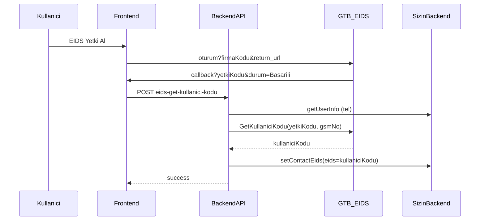
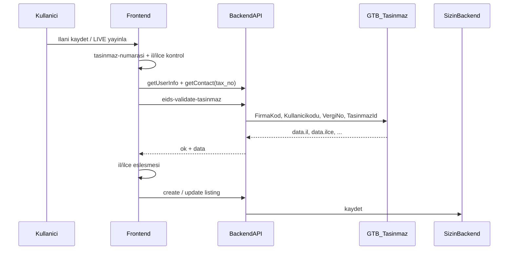

# EİDS (Elektronik İlan Doğrulama Sistemi) Entegrasyon Rehberi

Bu doküman, Ticaret Bakanlığı EİDS entegrasyonunu başka bir projeye (yapay zeka ile veya elle) taşımak için hazırlanmıştır.  
Kapsam: **kullanıcı yetkilendirme** + **ilan girme / yayınlama sırasında taşınmaz doğrulama**.

---

## 1. Kavramlar (karıştırma)

| Kavram | Ne | Nerede tutulur |
|--------|----|----------------|
| `firmaKodu` | Üye işyerinin EİDS firma UUID’si | Frontend + backend (env önerilir) |
| `yetkiKodu` | Bakanlık oturumundan dönen **kısa ömürlü** kod | Sadece callback query; DB’ye yazılmaz |
| `kullaniciKodu` | GTB’den gelen kalıcı kullanıcı kodu | Kullanıcı/contact kaydında `eids` alanı |
| `tasinmazId` / `tasinmaz-numarasi` | Taşınmaz numarası (ilan özelliği) | İlan property: code = `tasinmaz-numarasi` |
| `vergiNo` | Bağlı ofisin vergi numarası | Ofis/contact `tax_no` |
| `auth_cert_no` | Ofis **yetki belge no** (public rozet) | Ofis kaydı; `user.eids` ile aynı şey değil |

**Önemli:** Callback’te gelen `yetkiKodu` kaydedilmez. Kaydedilen şey GTB `GetKullaniciKodu` cevabındaki `kullaniciKodu`’dur → backend’de `setContactEids({ eids: kullaniciKodu })`.

---

## 2. Dış servisler

### 2.1 Tarayıcı – EİDS oturum

```
https://eids.ticaret.gov.tr/oturum?firmaKodu=<FIRMA_UUID>&return_url=<ENCODED_CALLBACK_URL>
```

- Kullanıcı e-Devlet / EİDS ile giriş yapar.
- Başarılı dönüş örneği:
  ```
  /eids-callback?yetkiKodu=XXXX&durum=Basarili
  ```
- `durum` değeri `Basarili` değilse yetki alınmamış sayılır.

### 2.2 GTB API – Kullanıcı kodu

- **URL:** `https://ws.gtb.gov.tr:8443/EidsApi/Kullanici/GetKullaniciKodu`
- **Auth:** HTTP Basic Auth (GTB kullanıcı + şifre)
- **Method:** `POST`
- **Body:**
  ```json
  {
    "yetkiKodu": "<callback’ten gelen>",
    "gsmNo": "05321234567"
  }
  ```
- **gsmNo formatı:** Türkiye GSM, `0` ile başlayan 11 hane (örn. `05321234567`).  
  Kullanıcı telefonunu normalize et: `+90 (532) ...` → digits → `0XXXXXXXXXX`.
- **Başarılı cevap (özet):**
  ```json
  {
    "ad": "...",
    "soyad": "...",
    "kullaniciKodu": "...",
    "hataMesaji": null,
    "hataKodu": null
  }
  ```
- `hataKodu` / `hataMesaji` doluysa hata.

### 2.3 GTB API – Taşınmaz doğrulama

- **URL:** `https://ws.gtb.gov.tr:8443/EidsTasinmazAPI`
- **Auth:** HTTP Basic Auth (aynı GTB credentials)
- **Method:** `POST`
- **Body:**
  ```json
  {
    "FirmaKod": "<FIRMA_UUID>",
    "Kullanicikodu": "<kaydedilmiş eids / kullaniciKodu>",
    "VergiNo": "<ofis vergi no>",
    "TasinmazId": 123456789
  }
  ```
- **Başarı:** HTTP 200 + `statusCode === 200` + `data` dolu
- **data alanları (örnek):**
  ```json
  {
    "il": "İSTANBUL",
    "ilce": "KADIKÖY",
    "mahalle": "...",
    "ada": "...",
    "parsel": "...",
    "ilanSuresi": ...
  }
  ```
- Frontend bu `il` / `ilce` değerlerini formdaki adresle karşılaştırır.

### 2.4 Kendi backend’iniz (ör. BAMMA benzeri)

En az şu endpoint’ler gerekir:

| Endpoint | Amaç |
|----------|------|
| `GET getUserInfo` (veya eşdeğeri) | `tel`, `eids`, `connected_contact` (bağlı ofis no) |
| `POST setContactEids` | Body: `{ "eids": "<kullaniciKodu>" }` |
| `GET contact/{no}` | Ofis `tax_no` |
| (opsiyonel) `GET office/{id}?eids=true` | Public ilanda `auth_cert_no` |

Session: login sonrası cookie/header (örn. `X-SESSION`) zorunlu.

---

## 3. Ortam değişkenleri (önerilen)

```env
# Ticaret Bakanlığı firma UUID
EIDS_FIRMA_KOD=xxxxxxxx-xxxx-xxxx-xxxx-xxxxxxxxxxxx

# GTB Basic Auth (Ticaret Bakanlığı’ndan alınır)
EIDS_GTB_USER=...
EIDS_GTB_PASSWORD=...

# Kendi API
BAMMA_APP_URL=https://...
X_API_KEY=...
X_APP_ID=...
```

**Not:** Credentials’ı koda gömme; env’de tut. Firma kodunu da env’e al.

---

## 4. Yapılacak adımlar – Yetkilendirme (Auth)

### Adım A1 – Menü / UI girişi

- Kullanıcıda `eids` (veya eşdeğer alan) **boşsa** “EİDS Yetki Al” butonu göster.
- Buton → `/eids-auth` (veya sizin route’unuz).

### Adım A2 – Auth sayfası

1. Sayfa açılınca hemen yönlendir:
   ```
   https://eids.ticaret.gov.tr/oturum?firmaKodu=<EIDS_FIRMA_KOD>&return_url=<origin>/eids-callback
   ```
2. `return_url` absolute olmalı ve Bakanlık panelinde whitelist’e eklenmiş olmalı.

### Adım A3 – Callback sayfası

1. Query’den oku: `yetkiKodu`, `durum`.
2. `durum !== "Basarili"` veya `yetkiKodu` yok → hata / iptal mesajı.
3. Başarılıysa:
   ```http
   POST /api/eids-get-kullanici-kodu
   Body: { "yetkiKodu": "..." }
   ```
4. Başarı/hata UI → ana panele yönlendir.
5. Session’daki kullanıcı bilgisini yenile (menüden “Yetki Al” kaybolsun).

### Adım A4 – Backend: `POST /api/eids-get-kullanici-kodu`

Sıra **zorunlu**:

```
1) Auth kontrolü (session)
2) getUserInfo → tel al
3) tel → gsmNo normalize (0XXXXXXXXXX)
4) GTB GetKullaniciKodu { yetkiKodu, gsmNo }  (Basic Auth)
5) hata yoksa kullaniciKodu al
6) setContactEids { eids: kullaniciKodu }
7) { success: true, kullaniciKodu } dön
```

Telefon yok / geçersizse işlemi kes (GTB çağırma).

---

## 5. Yapılacak adımlar – İlan girme / yayınlama

EİDS doğrulaması **Türkiye (TR)** ilanlarında zorunlu tutulur. Yurt dışı adreste atlanabilir.

### 5.1 Formda zorunlu alanlar

1. Property / özellik:
   - `code`: `tasinmaz-numarasi`
   - Değer: sayısal taşınmaz no (mask örn. 9 hane)
2. Adres: il + ilçe adları (UAVT veya seçim listesi)
3. Kullanıcı: `eids` dolu olmalı (önce yetki alınmış olmalı)
4. Bağlı ofis: `tax_no` dolu olmalı

### 5.2 Kaydet / yayınla öncesi gate (sırayla)

```
IF ülke !== TR → EİDS atla, normal kayda geç

1. properties’ten tasinmaz-numarasi oku → tasinmazId (int)
   - yoksa: "Taşınmaz numarası zorunludur."

2. Formdan / UAVT’ten il adı + ilçe adı al

3. GET getUserInfo
   - connected_contact yoksa: "Bağlı ofis bilgisi bulunamadı."
   - eids yoksa: "EIDS yetkilendirmesini tamamlayın."

4. GET contact?no=<connected_contact>
   - tax_no yoksa: "Ofis vergi numarası bulunamadı."

5. POST /api/eids-validate-tasinmaz
   Body: {
     kullanicikodu: user.eids,
     vergiNo: contact.tax_no,
     tasinmazId: <number>
   }

6. Cevap ok !== true → "EIDS yetkiniz yok" (veya gelen message)

7. GTB data.il / data.ilce ↔ form il / ilçe karşılaştır
   - eşleşmezse: "Yetkiye göre il/ilçe bilgisi EIDS taşınmaz kaydı ile eşleşmiyor."

8. Hepsi OK → create-real-estate / create-listing / state=LIVE vb.
```

### Adım B1 – Backend: `POST /api/eids-validate-tasinmaz`

```
1) Auth
2) Body validate: kullanicikodu, vergiNo, tasinmazId
3) GTB EidsTasinmazAPI’ye POST (FirmaKod + alanlar, Basic Auth)
4) statusCode===200 && data → { ok: true, data }
5) Aksi → { ok: false, message: "EIDS yetkiniz yok" }
   (GTB ham hata istemciye basılmayabilir)
```

### Adım B2 – Adres eşleştirme (önerilen normalizasyon)

GTB bazen `İSTANBUL`, form bazen `ISTANBUL` döner. Karşılaştırırken:

1. `trim`
2. `toLocaleUpperCase("tr-TR")`
3. Türkçe harfleri ASCII’ye çevir: İ→I, Ş→S, Ğ→G, Ü→U, Ö→O, Ç→C
4. Tire/çoklu boşluk temizle, sondaki `MAH.` sil
5. Eşitlik **veya** biri diğerini `includes` ediyorsa kabul

İl veya ilçe adı boşsa (UAVT sadece kod döndüyse) adres karşılaştırmasını **atlayıp** sadece sahiplik validate’ini zorunlu tutmak yanlış pozitifi azaltır.  
**Yeni ilan create** akışında ise il/ilçe genelde zorunlu tutulur.

### Adım B3 – Hangi aksiyonlarda EİDS gerekir?

| Aksiyon | EİDS zorunlu mu? |
|---------|------------------|
| Yeni portföy + ilan create (TR) | Evet, kaydetmeden önce |
| Taslak (DRAFT) kaydet | Hayır |
| Taslak → LIVE yayınla | Evet |
| LIVE ilanı güncelle | Evet (kaydetmeden önce) |
| Yurt dışı (ülke ≠ TR) | Hayır |

### Adım B4 – Property okuma tuhaflığı

Bazı API’lerde `value` alanı yanlışlıkla `"tasinmaz-numarasi"` (kod tekrarı) gelebilir.  
Gerçek numarayı şu sırayla dene:

1. `string_value` (digits → int)
2. `value` sayısal ise onu kullan
3. `value === "tasinmaz-numarasi"` ise yok say

---

## 6. Public ilan rozeti (opsiyonel ama istenen)

EİDS **kullanıcı kodu** ile **ofis yetki belge no** farklıdır.

- İlan detayında: ofisin `auth_cert_no` değerini göster.
- Ofis public endpoint: `GET /office/{id}?eids=true` → `{ auth_cert_no, title }`
- Banner metni örneği:  
  “{Ofis} — Yetki Belge No: {auth_cert_no}  
  Ticaret Bakanlığı Elektronik İlan Doğrulama Sistemi (EİDS) kapsamında ilan verme yetkisine sahiptir.”

---

## 7. Sequence diyagramları

### 7.1 Yetkilendirme



### 7.2 İlan girme / yayınlama (TR)



---

## 8. Backend API sözleşmesi (Next benzeri örnek)

### `POST /api/eids-get-kullanici-kodu`

- Auth: session zorunlu  
- Body: `{ yetkiKodu: string }`  
- 200: `{ success: true, kullaniciKodu: string }`  
- 400: telefon yok, GTB hata, yetkiKodu eksik  
- 502: `kullaniciKodu` gelmedi  

### `POST /api/eids-validate-tasinmaz`

- Auth: session zorunlu  
- Body: `{ kullanicikodu: string, vergiNo: string, tasinmazId: number|string }`  
- 200 success: `{ ok: true, data: { il, ilce, mahalle, ada, parsel, ... } }`  
- 200 fail: `{ ok: false, message: "EIDS yetkiniz yok" }`  

### `POST /api/set-contact-eids` (opsiyonel ayrı route)

- Body: `{ eids: string }`  
- Not: Asıl akışta genelde `eids-get-kullanici-kodu` içinde çağrılır; ayrı FE çağrısı şart değil.

---

## 9. Frontend checklist (AI’ya verilecek görev listesi)

- [ ] Env: `EIDS_FIRMA_KOD`, `EIDS_GTB_USER`, `EIDS_GTB_PASSWORD`
- [ ] Sayfa: `/eids-auth` → Ticaret Bakanlığı oturum redirect
- [ ] Sayfa: `/eids-callback` → yetkiKodu + durum işle
- [ ] API: `eids-get-kullanici-kodu` (tel normalize + GTB + setContactEids)
- [ ] Kullanıcı modelinde `eids` alanı; menüde yoksa “Yetki Al”
- [ ] İlan formunda `tasinmaz-numarasi` alanı
- [ ] API: `eids-validate-tasinmaz`
- [ ] Create (TR) kaydetmeden önce EİDS gate
- [ ] DRAFT→LIVE ve LIVE update öncesi aynı gate
- [ ] İl/ilçe toleranslı karşılaştırma util’i
- [ ] (Opsiyonel) Public ilanda `auth_cert_no` rozeti
- [ ] Bakanlık panelinde `return_url` whitelist

---

## 10. Sık hatalar

1. **Callback URL whitelist’te değil** → Bakanlık geri dönmez / hata.
2. **Telefon formatı yanlış** → `GetKullaniciKodu` fail.
3. **yetkiKodu’yu DB’ye yazmak** → yanlış; `kullaniciKodu` yazılmalı.
4. **Vergi no ofiste yok** → taşınmaz validate her zaman fail.
5. **İl/ilçe İ/I farkı** → normalize etmeden eşleşmez.
6. **Taslak kaydı için EİDS istemek** → UX kötü; LIVE’da iste.
7. **Credentials’ı client’a koymak** → GTB Basic Auth sadece server-side.
8. **`auth_cert_no` ile `eids` karıştırmak** → rozet vs kullanıcı yetkisi farklı.

---

## 11. Minimum dosya iskeleti (öneri)

```
pages/
  eids-auth.tsx
  eids-callback.tsx
api/
  eids-get-kullanici-kodu.ts
  eids-validate-tasinmaz.ts
  set-contact-eids.ts          # opsiyonel proxy
utils/
  eids-tasinmaz-address.ts     # normalize + match
  eids-listing-publish-validation.ts  # create/publish ortak gate
components/
  ListingEidsBanner.tsx        # public rozet
```

---

## 12. Yapay zekaya kopyalanacak kısa prompt

Aşağıdaki metni başka projede AI’ya verebilirsin:

> Ticaret Bakanlığı EİDS entegrasyonu yap. İki akış var:  
> 1) Kullanıcıyı `eids.ticaret.gov.tr/oturum?firmaKodu=...&return_url=...` ile yetkilendir; callback’te `yetkiKodu` + `durum=Basarili` gelince server’da GTB `GetKullaniciKodu` (Basic Auth, gsmNo normalize) çağır; dönen `kullaniciKodu`’nu kullanıcıya `eids` olarak kaydet.  
> 2) TR ilan create / LIVE publish öncesi: `tasinmaz-numarasi` + ofis `tax_no` + user `eids` ile GTB `EidsTasinmazAPI` validate et; dönen il/ilçe’yi form adresiyle Türkçe-normalize ederek eşleştir; OK değilse kaydı engelle. DRAFT’ta EİDS isteme. Secrets sadece server env’de. Detay için EIDS-ENTEGRASYON.md’yi uygula.

---

*Bu rehber hausberry / ZeOnline EİDS uygulamasından çıkarılmıştır. Firma kodu ve GTB credentials mevcut projeden / Ticaret Bakanlığı’ndan alınmalıdır.*
